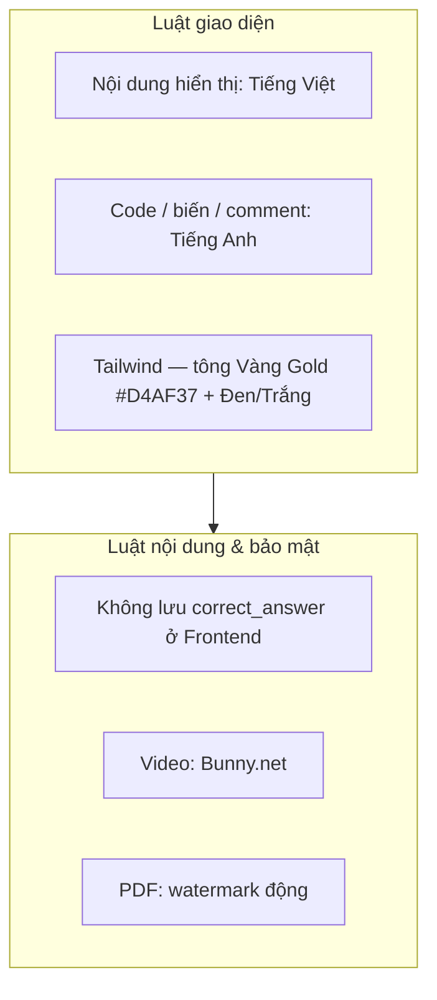
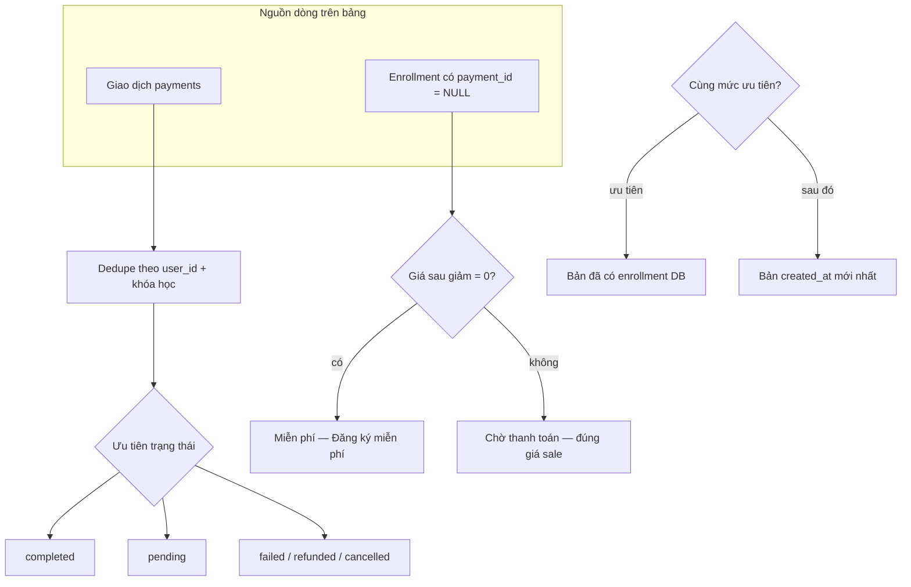
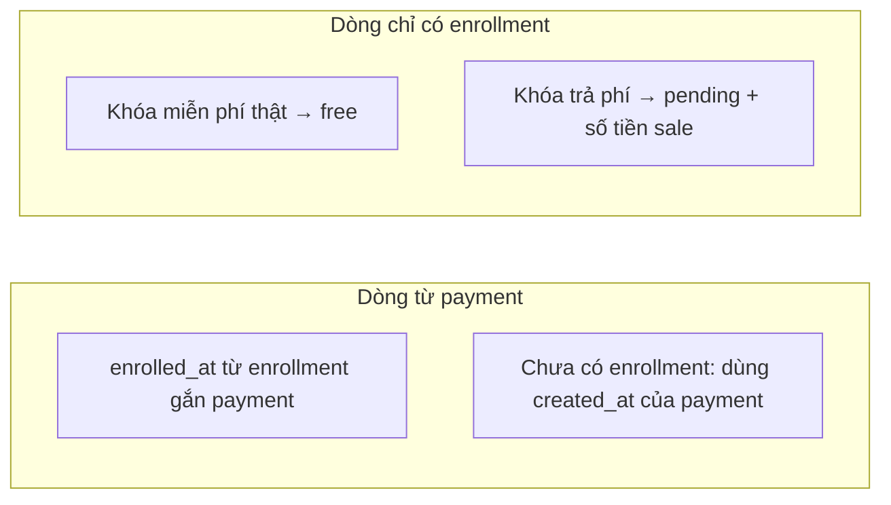
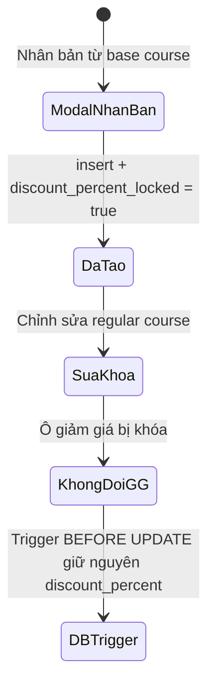
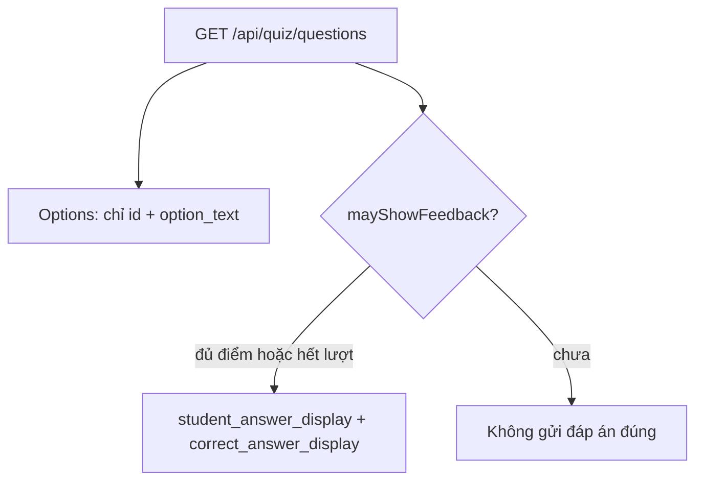
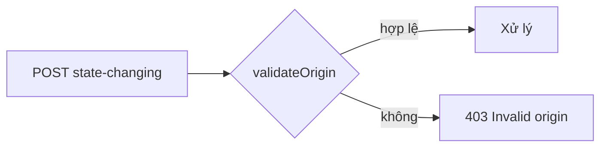
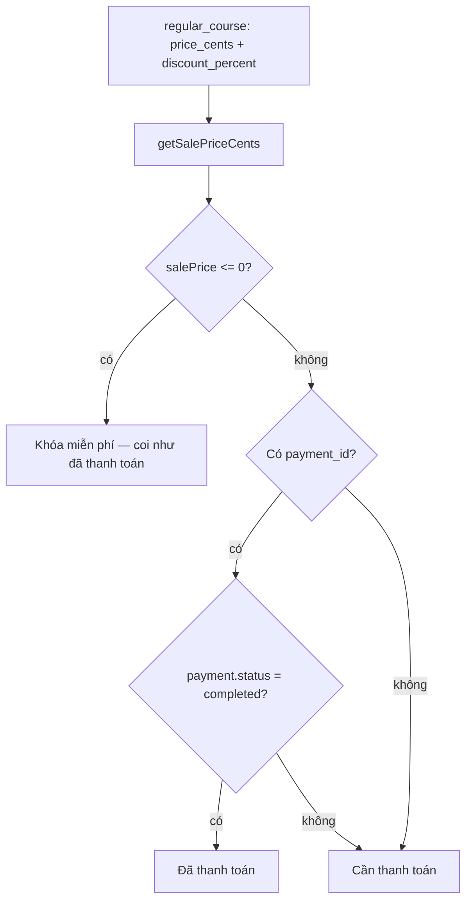
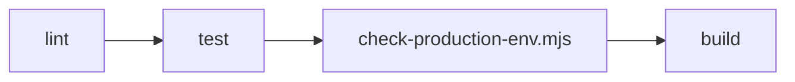

# Quy tắc logic nền tảng KM Global (E-learning)

Tài liệu tóm tắt các luật nghiệp vụ và kỹ thuật đã áp dụng trong codebase. Có thể xem biểu đồ trên [mermaid.live](https://mermaid.live) hoặc trình xem Markdown hỗ trợ Mermaid.

---

## 1. Quy tắc tổng quan (UI & an toàn)

Xem thêm `.cursorrules` trong repo.

---

## 2. Báo cáo Owner — thanh toán & đăng ký

**File tham chiếu:** `app/api/owner/reports/payments/route.ts`, `app/owner/reports/page.tsx`

**Khóa dedupe (payment):**

- `user_id` **null** → **không gộp** (mỗi `payment.id` một dòng).
- Còn lại: khóa = `user_id` + danh sách `course_id` đã sắp xếp (enrollment + metadata).

---

## 3. Ngày đăng ký & học viên trên báo cáo

---

## 4. Khóa học clone — cố định % giảm giá

**Migration:** `supabase/migrations/20260324140000_regular_courses_discount_locked.sql`  
**UI:** `app/admin/base-courses/.../BaseCourseDetail.tsx`, `app/admin/regular-courses/.../edit/page.tsx`

---

## 5. Quiz API — không lộ đáp án cho client

**File:** `app/api/quiz/questions/route.ts`

---

## 6. API thay đổi trạng thái — CSRF (`validateOrigin`)

**File:** `lib/csrf.ts`

Production cần `NEXT_PUBLIC_SITE_URL` hoặc `NEXT_PUBLIC_APP_URL` (xem `scripts/check-production-env.mjs`).

---

## 7. Truy cập học theo thanh toán (enrollment)

**File:** `lib/enrollment-payment-status.ts`

---

## 8. CI (kiểm tra tự động)

**File:** `.github/workflows/ci.yml`, script `npm run ci` trong `package.json`

---

## 9. Triển khai migration Supabase

**File:** `supabase/DEPLOY_CHECKLIST.md`

- Backup trước khi chạy migration mới.
- Giữ thứ tự file `supabase/migrations/*_*.sql`.
- Xác minh trigger/cột sau khi push (ví dụ `discount_percent_locked`).

---

*Cập nhật khi thêm luật nghiệp vụ mới — nên đồng bộ sơ đồ và mô tả ngắn tại đây.*
